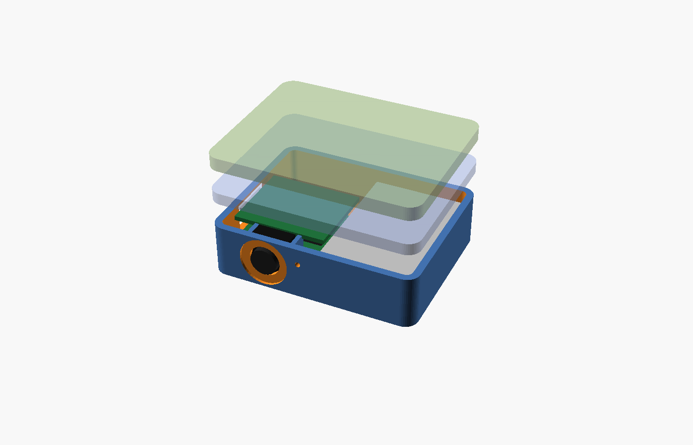

# Blueprint: cap-brim clip

A 46 × 36 × 14.5 mm box that hangs under the brim of a cap, held through the brim by two magnets in
its lid and two in a 3 mm top plate. The camera looks forward from the front wall at eye level, the
button is on the underside (reach up and press). XIAO ESP32-S3 Sense + LP502030.



| File | What |
|------|------|
| `cap-brim-clip.scad` | Model; `part = "shell" \| "lid" \| "plate" \| "cap" \| "preview"`. |
| `stl/` | shell, magnet lid, top plate, button cap. |
| `drawings/` | `plan.svg` (parts and button), `front.svg` (lens), `left-end.svg` (USB-C), `top-plate.svg`. |
| `config.h` | Firmware overrides. |

## Layout

```
plan (from below)                      side
┌────────────────────────┐             brim ═══════════════ top plate 3 mm (2 magnets)
│ cam ■  │               │             ┌──────────────────┐ lid 2.6 (2 magnets)
│ ┌─────┐│ ┌──────────┐  │             │ ▓ XIAO 8.5 ▓ ░batt░│
│ │XIAO ││ │ LP502030 │  │        ◉cam │ antenna, switch   │ floor 1.6, button cap below
│ │     ││ │ 20 × 30  │  │             └──────────────────┘
│ └USB-C┘│ └──(btn)───┘  │
└────────────────────────┘  front wall at the top of the drawing, lens here
```

- Board and cell side by side (nothing stacks), so the box is only 14.5 mm thick; the camera
  module stands in a cradle against the front wall on its ribbon, which exits toward the socket
  that faces the floor.
- The low-profile 6 × 6 × 3.1 switch sits under the battery (3.5 mm of room), cap through the floor.
- The flex antenna lies on the floor next to the switch, 2.5 mm under the battery.
- Mount: lid magnets attract the top-plate magnets through a 2–3 mm brim (≈ 0.3 kg per pair; the
  box weighs ≈ 23 g with the plate, so it survives running). No clip to break, fits any cap.

## Bill of materials

| Qty | Part | Note |
|-----|------|------|
| 1 | XIAO ESP32-S3 Sense with camera | bought |
| 1 | LP502030 250 mAh | bought |
| 1 pair | JST 1.25 pigtails | bought |
| 1 | **6 × 6 × 3.1 mm** low-profile tactile switch | **add** (the kit's 6 × 6 × 5 is too tall here) |
| 2 | 220 kΩ | starter kit |
| 4 | N52 magnets Ø8 × 2 | **add** (2 in the lid, 2 in the plate) |
| 4 prints | shell, lid, top plate, button cap | PETG for the lid and plate (sun on a cap softens PLA) |

Runtime ≈ 1.5 h streaming, ≈ 4.5 h stills.

## Wiring

Same as the lapel badge: cell → JST 1.25 → BAT+/BAT−, divider to A0, switch to D1/GND, antenna to
U.FL, camera into the Sense socket. The switch leads go up along the battery rail.

## Assembly

1. Print; glue the lid magnets and the plate magnets **so that lid and plate attract** (mark N/S
   with a marker before gluing).
2. Press the switch into its floor pocket, plunger over the Ø4.4 hole; drop the button cap in from
   outside (stem up through the hole) and hold it with a dab of flexible glue on the cap rim.
3. Seat the camera upright in the cradle, lens in the front window, tack with cyanoacrylate.
4. Stack in, Sense board down, USB-C into the left cut-out; latch the ribbon.
5. Antenna on the floor beside the switch; battery over both, 30 mm running front-to-back.
6. Lid on. On the cap: box under the brim with the lens flush with the brim's front edge, plate on
   top. The brim shades the lens; the mic hole is beside it.

## Notes

- The image is the most stable of the three builds (head moves less than the chest) and looks where
  the wearer looks, which suits the app's "who is in front of me" question best.
- Sun: PETG everywhere, and leave the camera's IR filter alone; the Sense module already has one.
