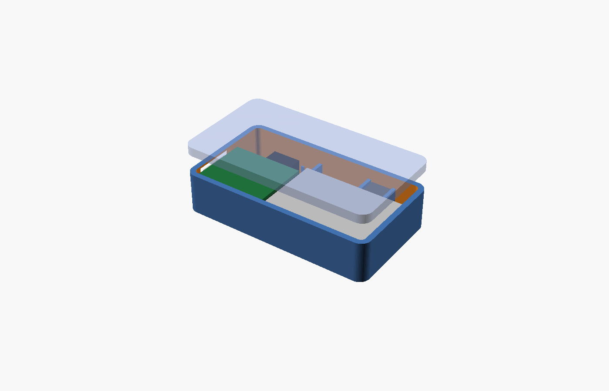

# Blueprint: lapel badge / pendant

A 56 × 31 × 14.5 mm magnetic badge worn on the chest, camera facing the person you talk to. The same
shell with `bail = true` becomes a pendant on a lanyard. Built from the XIAO ESP32-S3 Sense, one
LP502030 cell, the kit antenna, a 6 × 6 tactile switch and two Ø8 × 2 magnets.



| File | What |
|------|------|
| `lapel-badge.scad` | Parametric model (needs `../lib/parts.scad`). `part = "shell" \| "lid" \| "cap" \| "preview"`, `bail = true` for the pendant loop. |
| `stl/` | Ready-to-print: shell, pendant shell, magnet lid, button cap. |
| `drawings/` | `front.svg` (lens, mic), `top-edge.svg` (button), `left-end.svg` (USB-C, LED), `section-aa.svg` (stack-up). Regenerate with `python3 ../tools/drawings.py`. |
| `config.h` | Firmware overrides for this build. |

## Layout

```
front face (what others see)                 section through the lens
┌───────────────────────────────┐            ┌──────────────────────────┐ lid 2.6 with 2 magnets
│ ◉ lens      [btn on top edge] │            │ ▓▓ XIAO stack 8.5 ▓▓  ■cam│
│ ┌────────┐ ┌───────────────┐  │            │ sense board & socket ▼    │
│ │ XIAO   │ │ LP502030      │  │            └────────────◉─────────────┘ front wall 1.6
│ │ 21×17.8│ │ 30×20×5.3     │  │   USB-C out of the left end, plug cut-out 13 × 7
│ └USB-C───┘ └───antenna─────┘  │   magnets behind the board and behind the battery
└───────────────────────────────┘
```

- The camera module is **unplugged from the Sense board and re-seated on its ribbon** so it sits
  beside the board (above it in the drawing) with the lens in the front wall; the stack is turned
  so the Sense board faces the front, which keeps the ribbon flat and short (≈ 12 mm of travel).
- Battery lies against the back lid; the flex antenna is glued to the inside of the front wall in
  front of the battery (2.5 mm air gap). Keep the antenna at least 10 mm from the magnets.
- Depth: 1.6 front wall + 8.9 cavity + 1.2 lid lip + 2.6 magnet lid = **14.5 mm**.
- Weight ≈ 19 g (shell 10, electronics 7.5, magnets 1.5).

## Bill of materials

| Qty | Part | Note |
|-----|------|------|
| 1 | Seeed XIAO ESP32-S3 Sense with camera | bought |
| 1 | EEMB LP502030 250 mAh with PCM | bought (4-pack) |
| 1 pair | JST 1.25 2-pin pigtails (male + female) | bought; makes the cell swappable |
| 1 | 6 × 6 × 5 tactile switch | starter kit |
| 2 | 220 kΩ resistors | starter kit; battery divider |
| 2 | N52 disc magnets Ø8 × 2 | **add** (≈ $5 / 20) |
| 1 | Steel disc or plate ≈ 20 × 30 × 0.5 mm, or two more magnets | **add**; goes inside the garment |
| — | 30 AWG silicone wire, Kapton tape, cyanoacrylate, 2 mm heat-shrink | — |
| 3 prints | shell, lid, button cap | PETG or PLA, 0.2 mm layers, 4 perimeters, no supports |

Runtime on the 250 mAh cell: ≈ 1.5 h continuous MJPEG, ≈ 4.5 h stills every 4 s.

## Wiring

```
LP502030 ──JST PH (cut off)──╳── female JST 1.25 ─┐
                                                  ├─ male JST 1.25 pigtail ──► XIAO BAT+ (red) / BAT− (black, pad nearest USB-C)
BAT+ ──► 220 kΩ ──┬──► A0 (GPIO1)      battery percent (WIT_BATTERY_PIN 1, divider 2.0)
                  └──► 220 kΩ ──► GND
Tactile switch ──► D1 (GPIO2) and GND  (internal pull-up; tap / long press)
Flex antenna ──► U.FL on the main board
Camera module ──► 24-pin FPC socket on the Sense board (contacts down; lock the latch)
```

The XIAO's castellated pads take the 30 AWG wires directly; no headers. Solder BAT+/BAT− first, then
tape the pads. Check with a meter that BAT+ reads ≈ 3.7–4.2 V **before** connecting USB-C.

## Assembly

1. Print the three parts. Test-fit the lid: the lip should push in with thumb pressure.
2. Glue the two magnets into the lid pockets (note the polarity if you use a magnet counterpart
   instead of a steel plate). Press the switch into its pocket on the top edge, plunger in the hole.
3. Unplug the camera from the Sense board. Seat the module lens-down between the four posts, lens in
   the Ø7 window, and tack two corners with cyanoacrylate. Route the ribbon toward the board area.
4. Drop the stack in **Sense board down**, USB-C into its cut-out; re-latch the ribbon into the socket.
5. Glue the antenna flat on the floor in the battery area; plug its U.FL. Lay the battery over it
   with the leads toward the top edge; plug the JST 1.25 pair and tuck it above the battery.
6. Wire the switch to D1/GND and the divider to A0. Close the lid. Charge through the USB-C cut-out.
7. Flash with `config.h` from this folder (`WIT_BATTERY_PIN 1`). The LED is only visible through the
   USB-C cut-out; add a 1.5 mm light pipe hole on the top edge if you want it on the front.

## Wearing it

Place the badge on the shirt, the steel plate (or second magnet pair) behind the fabric. Camera at
chest height sees a face at 1–3 m; a jacket lapel can shadow the lens, so wear it on the outer layer.
Tap = ask the app for a lookup; long press = stop.
