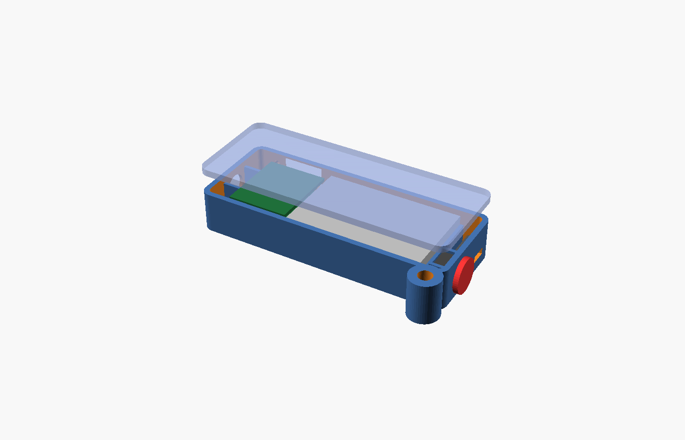

# Blueprint: point-and-ask fob

A 74 × 29 × 13.9 mm key-fob: camera in the nose, a big button and a power slide switch in the tail,
key ring on the corner. You point it at someone and press; the board sends a still, the app answers.
The LP502540 500 mAh cell gives a whole day of occasional use. The most deliberate, visible way to
use WhoIsThis, and the easiest to put in a pocket.



| File | What |
|------|------|
| `point-and-ask-fob.scad` | Model; `part = "shell" \| "lid" \| "cap" \| "preview"`. |
| `stl/` | shell (with key-ring lobe), lid, button cap. |
| `drawings/` | `plan.svg`, `tail.svg` (button + slide), `nose.svg` (lens), `side.svg` (USB-C). |
| `config.h` | Firmware overrides. |

## Layout

```
plan (lid removed)
┌──────────────────────────────────────────────────────┐
│ ■cam │ XIAO 17.8 × 21 │ LP502540 40 × 25     │ btn ▣ │○ key ring
│  ◉   │ USB-C ↑ (side) │   antenna under it   │ slide │
└──────────────────────────────────────────────────────┘
 nose                                              tail
```

- The board is turned so its USB-C exits the right-hand side wall (the nose has the camera, the
  tail the controls). The stack's socket faces the floor; the camera module stands in a cradle at
  the nose with the ribbon curling back to it.
- The 500 mAh cell runs the length of the body, flex antenna on the floor under it.
- Tail compartment (7 mm): 6 × 6 × 5 tactile switch behind a Ø4.4 hole with a Ø10 printed cap, and an
  SS12D00 slide switch in the battery lead for a true off (the Sense board leaks 3 mA asleep).
- 13.9 mm thick; weight ≈ 28 g.

## Bill of materials

| Qty | Part | Note |
|-----|------|------|
| 1 | XIAO ESP32-S3 Sense with camera | bought |
| 1 | **LP502540 500 mAh with PCM** | **add** (≈ $8); the bought LP502030 also fits with 10 mm of free length |
| 1 pair | JST 1.25 pigtails | bought |
| 1 | 6 × 6 × 5 tactile switch | starter kit |
| 1 | **SS12D00 slide switch** | **add** (or from the starter kit if it has one) |
| 2 | 220 kΩ | starter kit |
| 1 | passive buzzer 9 mm (optional) | starter kit; fits beside the tail switch |
| 1 | split key ring Ø20 | — |
| 3 prints | shell, lid, button cap | PETG, 0.2 mm; shell flat on its floor, no supports |

Runtime on 500 mAh ≈ 3 h streaming, ≈ 9 h stills; as a press-to-ask device (stills on demand and
Wi-Fi modem sleep) a day.

## Wiring

```
LP502540 ─► SS12D00 (in the red lead) ─► female JST 1.25 ─► male pigtail ─► BAT+ / BAT−
BAT+ ─► 220 kΩ ─┬─► A0 (GPIO1)
                └─► 220 kΩ ─► GND
Tail tactile ─► D1 (GPIO2) / GND
Buzzer (optional) ─► D2 (GPIO3) / GND
Antenna ─► U.FL;  camera ─► Sense socket
```

## Assembly

1. Print. Thread the key ring through the lobe before anything else.
2. Switches into the tail: tactile between the two pocket walls, plunger in the hole; slide switch
   with its knob through the slot, glued at its base. Button cap from outside.
3. Camera upright in the nose cradle, lens in the window; tack. Stack in, Sense board down, USB-C
   into the side cut-out; latch the ribbon.
4. Antenna on the floor, battery over it, leads toward the tail; JST pair in the tail compartment.
5. Lid on; charge through the side cut-out. The XIAO's charger feeds the BAT pads, and the slide
   switch sits in the cell's red lead, so the cell charges only while the switch is **on**: switch
   on, plug in, wait for the charge LED to go out.

## Firmware note

Today the plugin requests stills every 4 s and the app treats `tap` as a lookup trigger. A fob-mode
(`WIT_CAPTURE_ON_TAP`: `/capture` returns a fresh frame only after a press, Wi-Fi modem-sleeps in
between) is a small firmware change listed as a follow-up in `../candidates.md`.
